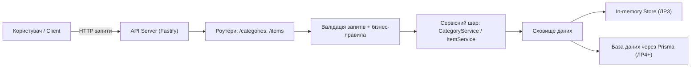
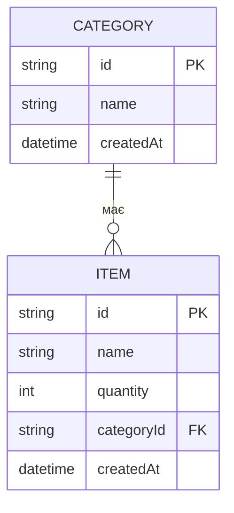

# ЛР2 — Архітектура та модель даних

## Компоненти та взаємодія

**Пояснення:**

- **API Server** приймає HTTP-запити та повертає відповіді.
- **Роутери** відповідають за маршрути `/categories` і `/items`.
- **Валідація + правила** забезпечують коректність даних (наприклад, `quantity >= 0`, категорія існує).
- **Сервіси** інкапсулюють бізнес-логіку.
- **Сховище даних** на ЛР3 — in-memory, на ЛР4 — реальна БД через Prisma.

---

## ER-модель (сутності та зв’язки)

**Обмеження/інваріанти:**

- `Item.categoryId` має посилатися на існуючу `Category.id`.
- `Item.quantity` — невід’ємне число.
- Видалення категорії заборонено, якщо є хоча б один `Item` з `categoryId = Category.id`.
