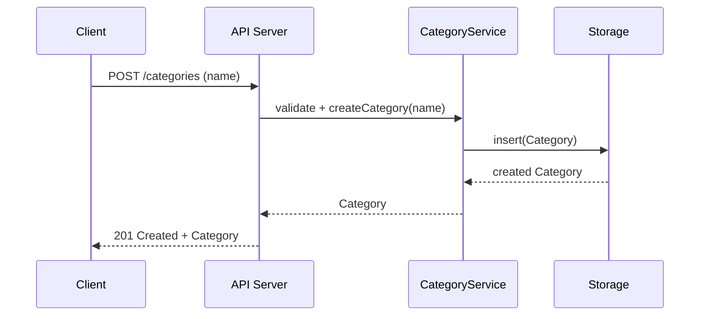
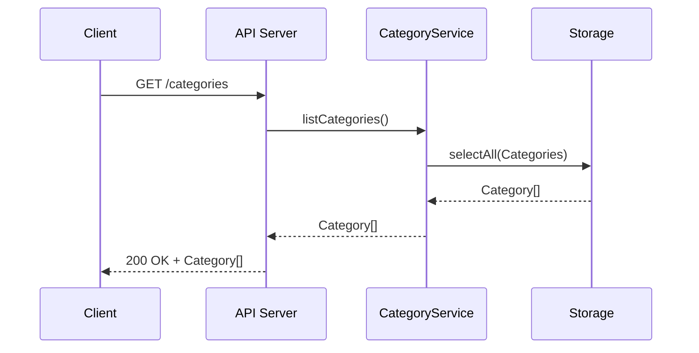
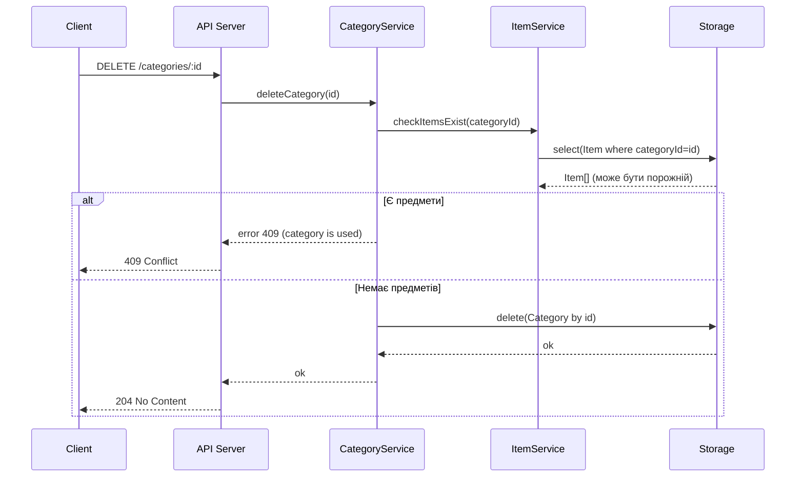
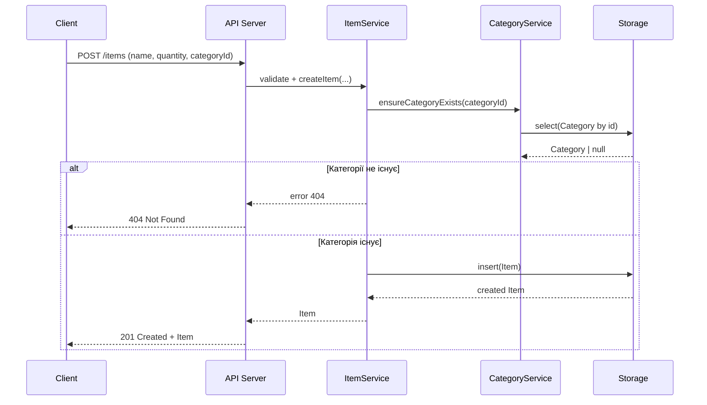
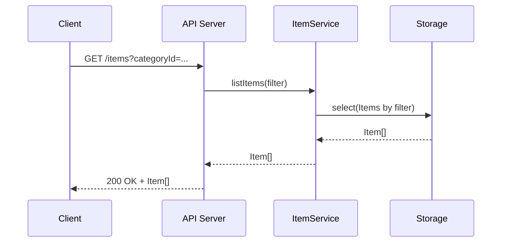
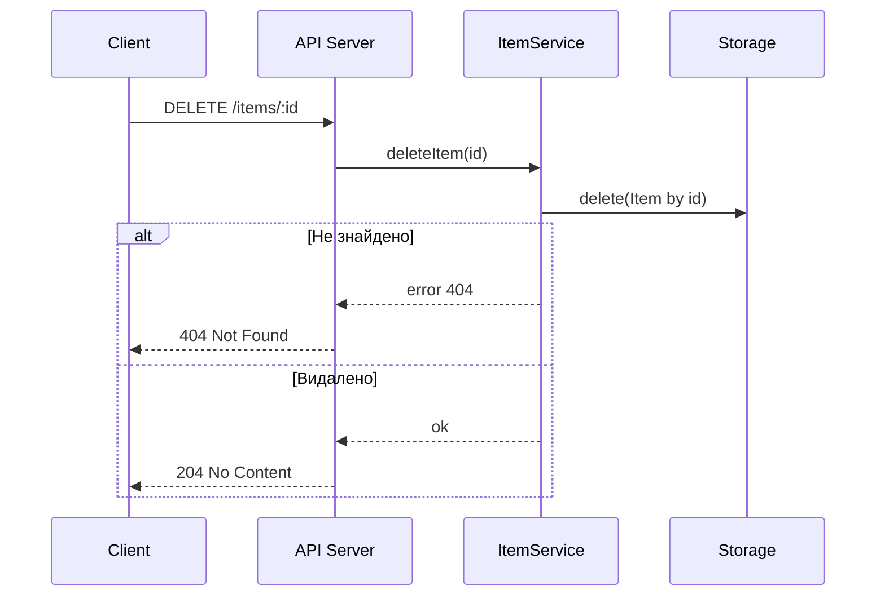

# ЛР2 — Ключові сценарії та зміни даних

## Сценарій 1: Створення категорії

**Запит:** `POST /categories`  
**Тіло:** `{ "name": "Food" }`

**Зміна даних:** додається новий запис `Category` з унікальним `id` та `createdAt`.

---

## Сценарій 2: Отримання списку категорій

**Запит:** `GET /categories`

**Агрегація:** повертається масив категорій. Додатково (за потреби в майбутньому) може бути сортування за `createdAt`.

---

## Сценарій 3: Видалення категорії

**Запит:** `DELETE /categories/:id`

**Зміна даних:**

- якщо немає предметів — видаляється `Category`;
- якщо предмети існують — зміни не відбуваються, повертається `409 Conflict`.

---

## Сценарій 4: Створення предмета

**Запит:** `POST /items`  
**Тіло:** `{ "name": "Bread", "quantity": 2, "categoryId": "<id>" }`

**Зміна даних:** додається новий `Item`.  
**Правила:** `quantity >= 0`, `categoryId` обов’язковий і має існувати.

---

## Сценарій 5: Отримання списку предметів (з фільтром)

**Запит:** `GET /items?categoryId=<id>`

**Агрегація:** повертається масив `Item[]`.

- без `categoryId` — всі предмети;
- з `categoryId` — тільки предмети цієї категорії.

---

## Сценарій 6: Видалення предмета

**Запит:** `DELETE /items/:id`

**Зміна даних:** видаляється `Item` за `id` або повертається `404`, якщо не існує.
